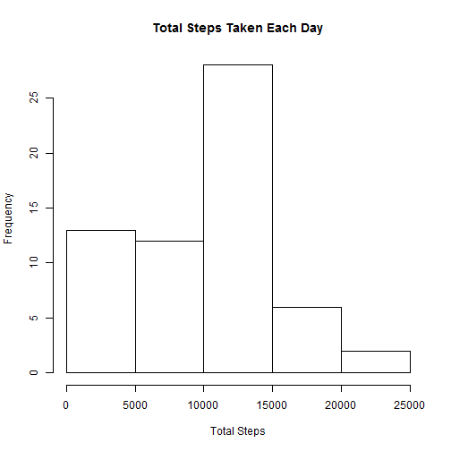
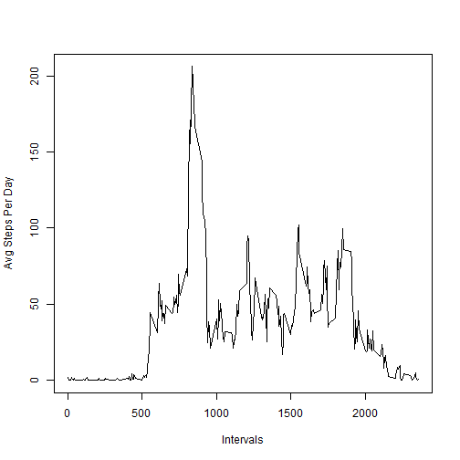
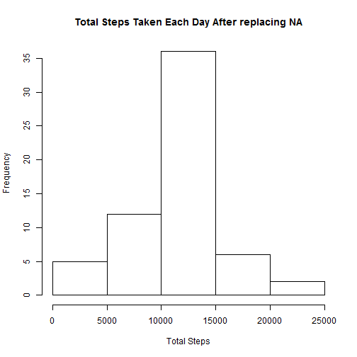
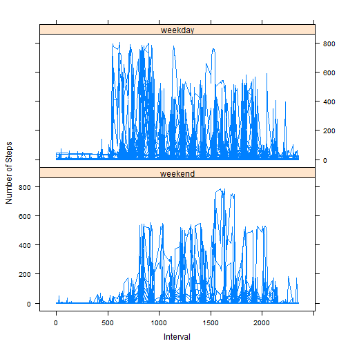

This document presents an analysis of the data collected from a larger number of personal activity monitoring devices.
The devices collect data at 5 minute intervals through out the day. The data consists of two months of data from anonymous individuals collected during the months of October and November, 2012 and include the number of steps taken in 5 minute intervals each day.

## Loading and preprocessing the data

```r
activityData <- read.csv("activity.csv", stringsAsFactors = FALSE)
```


## What is mean total number of steps taken per day?

```r
totalSteps <- aggregate(activityData$steps, by=list(activityData$date), FUN=sum, na.rm = TRUE)
```

 

Mean of total steps:

```r
mean(totalSteps$x)
```

```
## [1] 9354.23
```

Median of total steps:

```r
median(totalSteps$x)
```

```
## [1] 10395
```
## What is the average daily activity pattern?

```r
avgSteps <- aggregate(activityData$steps, by=list(activityData$interval), FUN=mean, na.rm = TRUE)
```
 

On average across all the days in the dataset, the 5-minute interval containing the maximum number of steps is

```
## [1] 835
```

## Imputing missing values
Total number of missing values in the dataset 

```r
sum(!complete.cases(activityData))
```

```
## [1] 2304
```
Replacing NA with mean of average steps across all days for that interval

```r
for(i in 1:nrow(activityData)) {
  row <- activityData[i,]
  # do stuff with row
  if (is.na(row[1])) {
    CleanedActivityData[i,1] <- as.numeric(avgSteps[which(avgSteps$Group.1 == row$interval), 2])
  } else {
    CleanedActivityData[i,1] <- as.numeric(row$steps)
  }
  CleanedActivityData[i,2] <- row$date
  CleanedActivityData[i,3] <- row$interval
}

totalStepsInCleanedData <- aggregate(CleanedActivityData$steps, by=list(CleanedActivityData$date), FUN=sum, na.rm = TRUE)
```

 
Mean of total steps:

```r
mean(totalStepsInCleanedData$x)
```

```
## [1] 10766.19
```

Median of total steps:

```r
median(totalStepsInCleanedData$x)
```

```
## [1] 10766.19
```

## Are there differences in activity patterns between weekdays and weekends?

```r
CleanedActivityData$date <- as.Date(CleanedActivityData$date)
weekdays1 <- c('Monday', 'Tuesday', 'Wednesday', 'Thursday', 'Friday')
CleanedActivityData$wDay <- factor((weekdays(CleanedActivityData$date) %in% weekdays1), 
                   levels=c(FALSE, TRUE), labels=c('weekend', 'weekday')) 
```
 
